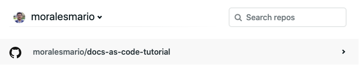

# Deploying to Netlify

Now you are going to connect your repository with Netlify.

1. Log in to [Netlify](https://www.netlify.com) or create a new account.
2. Click the **New site from Git** button.
3. Click the **GitHub** button.
4. Click **Continue**.  
**IMPORTANT**: Don't click the **Authorize** button if you are asked to authorize access to the Organization you belong to. You will grant access later only to your personal account.
5. Click the **Configure Netlify on GitHub** button.
6. Click your username when prompted.
7. Click the **Only select repositories** option.
8. Select the name of your repository you just created from the dropdown list.
9. Click **Install**.
10. Click the name of your repository under your username to go to the _build and deploy_ options.  

11. Under the **Deploy settings**:
    1. Leave **Owner** as default.
    2. **Branch to deploy**: `master`.
    3. **Build command**: `mkdocs build`.
    4. **Publish directory**: `site/`.
12. Click the **Deploy site** button.  
The deploying process starts. When finished, Netlify gives you the address where your site is deployed. Every time you commit your changes and push them to your remote Github repository, Netlify redeploys your site.