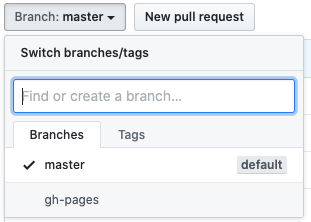
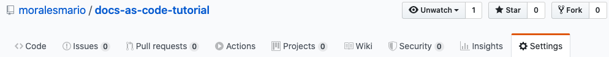
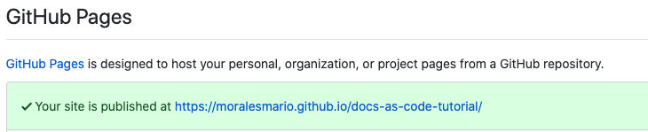

# Deploying to a Static Site Hosting Service

This section provides you with three different options to deploy and automate your deploy process to a site hosting service.

---

## Deploying to GitHub Pages

Deploying to GitHub Pages is the easiest way to host your documentation project. You only need to run the following command in your project directory:  
`mkdocs gh-deploy`.

MkDocs builds the static files and commits the changes to a new branch in your GitHub repository called `gh-pages`, which will be used by GitHub Pages as the documentation files source.

To verify that the branch has been created and to view your documentation site live:

1. Go to [GitHub](https://github.com/) and navigate to your documentation project repository.
2. Click the **Branch:** dropdown menu and look for a new branch called `gh-pages`.
  
If you have it, that means that your docs are ready in GitHub Pages.
3. Click the **Settings** tab at the upper right corner:

4. Navigate to the **GitHub Pages** section, where you can find the link to your documentation project page.


> **IMPORTANT**: To sync the deployment process with any new changes you push to your remote repository, you can merge the push command with the deploy command, like so:  
`git push -u origin master && mkdocs gh-deploy`  
This pushes any new changes to your master branch to keep your repository updated and builds and deploys those changes to your site.

# Alternatives for Deploying

## Deploying to an AWS S3 Bucket

To follow this approach:

1. Login to [Amazon Web Services](https://aws.amazon.com/) or create a new account.
2. [Create an S3 bucket](https://docs.aws.amazon.com/AmazonS3/latest/gsg/CreatingABucket.html)
3. [Configure the S3 bucket for static website hosting](https://docs.aws.amazon.com/AmazonS3/latest/user-guide/static-website-hosting.html#configure-bucket-website-hosting).
4. To deploy your files to the site:
    1. You can upload the static files in the `site` folder that you created with the `mkdocs build` command to the S3 bucket and your site is ready in the provided S3 website URL.
    2. You can use the Amazon CLI to sync the `build` with a `deploy` to S3.
        1. [Install the AWS CLI](https://docs.aws.amazon.com/cli/latest/userguide/cli-chap-install.html)
        2. [Configure the AWS CLI](https://docs.aws.amazon.com/cli/latest/userguide/cli-chap-configure.html)
        3. Run the following command inside your project directory to start the build process and deploy to your S3 bucket:  
        `mkdocs build && aws s3 sync site/ s3://<your-bucket-name>`.

## Deploying to Netlify

To ensure a smooth deployment with Netlify, you need to add a new configuration file called `requirements.txt` in your main project directory with the following line as its content:
```
mkdocs>=0.9.0
```
Your project structure must be something like the following:  
```
docs-as-code-tutorial
├── docs
|   ├── index.md
|   └── local-site.md
|   └── repo.md
|   └── deploy.md
├── .gitignore
├── mkdocs.yml
└── requirements.txt
```

To connect your repository with Netlify:

1. Log in to [Netlify](https://www.netlify.com) or create a new account.
2. Click the **New site from Git** button.
3. Click the **GitHub** button.
4. Click **Continue**.  
⚠ **IMPORTANT**: Don't click the **Authorize** button if you are asked to authorize access to the Organization you belong to. You will grant access later only to your personal account.
5. Click the **Configure Netlify on GitHub** button.
6. Click your username when prompted.
7. Click the **Only select repositories** option.
8. Select the name of your repository you just created from the dropdown list.
9. Click **Install**.
10. Click the name of your repository under your username to go to the _build and deploy_ options.  

11. Under the **Deploy settings**:
    1. Leave **Owner** as default.
    2. **Branch to deploy**: `master`.
    3. **Build command**: `mkdocs build`.
    4. **Publish directory**: `site/`.
12. Click the **Deploy site** button.  
The deploying process starts. When finished, Netlify gives you the address where your site is deployed. Every time you commit your changes and push them to your remote Github repository, Netlify redeploys your site.

---
