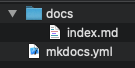
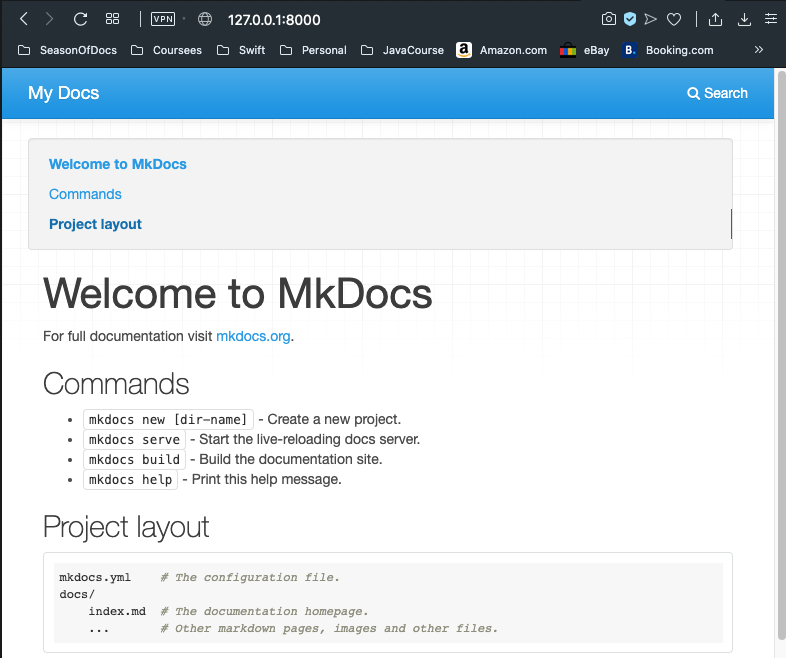
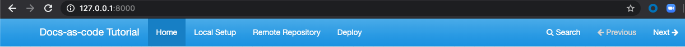

# Setting Up Your Local Project

This section guides you through the process of creating your local documentation repository.

1. Install **MkDocs** by running this command in your Terminal:  
`pip install mkdocs`
2. Verify the installation by running this command:  
`mkdocs --version`  
You should get something like this as a response:  
`mkdocs, version 1.0.4 from ...`
3. Run this command to create your local project:  
`mkdocs new docs-as-code-tutorial` – _You can use a different name for your project_  
This creates a folder with a configuration file called `mkdocs.yml` and a folder called `docs`, which contains an `index.md` file.  

The `index.md` file is the main page of your new site. You can add more pages there by creating new Markdown files inside the `docs` folder. We will get to that later.
4. Navigate to your created project with:  
`cd docs-as-code-tutorial`
5. You can preview your static site as you work on it by running the following command:  
`mkdocs serve`  
This command starts a local server with your rendered page so you can see how it will look before you publish it.
6. Open a web browser and go to the local **http** server listed in the last command response (`http://127.0.0.1:8000/`) to see your rendered page.


## Customizing Your Site

Now you can start modifying the files in your project with your documentation details.

1. Open the `index.md` file and change the title and information in the file and save them to see the changes update on your local server.
2. Open the `mkdocs.yml` file and change the `site_name` value to your documentation project name:  
`site_name: Docs-as-code Tutorial`

## Creating More Pages

You can add more pages to your site by modifying the `mkdocs.yml` configuration file. To do so, add the name of each page you want to add to your site and the file corresponding as `key: value` pairs under a `nav` key:

```yaml
site_name: Docs-as-code Tutorial
nav:
    - Home: index.md
    - Local Setup: local-site.md
    - Remote Repository: repo.md
    - Deploy: deploy.md
```

The order of the files is going to be the same in which they will appear on your navigation panel:

