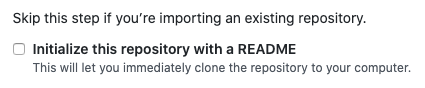

# Hosting Your Documentation Project in GitHub

This section explains how to store your project files in a remote repository.

## Creating a GitHub Repository

First, you need to create a GitHub repository where you will host your documentation files.

1. Go to [GitHub](https://github.com/) and login or create a new account if you don't have one.
2. Create a new repository.

3. Add a name and a description to your repository.  
**NOTE**: Don't initialize the reposotory with a README. Make sure the option is unchecked before you create the repository.  

4. Click **Create repository**.
5. Copy the `HTTPS` address –or `SSH` if you have **SSH keys** configured.

## Pushing Your Documents to the Remote GitHub Repository

Follow the next steps to push your documents to the remote repository:

1. Navigate to your project directory from a Terminal window
2. Run the following command to initialize your Git repository:  
`git init`
3. Add your documentation files to the repository with this command:  
`git add .`
4. Commit your changes:  
`git commit -m "first commit"`
5. Add your local repository to the remote GitHub repository with this command:  
`git remote add origin <HTTPS OR SSH ADDRESS CORRESPONDING TO YOUR REPOSITORY>`
6. Push your documents to GitHub:  
`git push -u origin master`